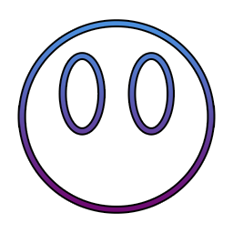

<!-- PROJECT SHIELDS -->
<!--
*** I'm using markdown "reference style" links for readability.
*** Reference links are enclosed in brackets [ ] instead of parentheses ( ).
*** See the bottom of this document for the declaration of the reference variables
*** for contributors-url, forks-url, etc. This is an optional, concise syntax you may use.
*** https://www.markdownguide.org/basic-syntax/#reference-style-links
-->

[![GNU GPLv3 License][license-shield]][license-url]
[![LinkedIn][linkedin-shield]][linkedin-url]

<!-- PROJECT LOGO -->
<br />
<p align="center">
  <a href="https://github.com/Nickprovs/Exodus.Prototype.UnityClient">
    
  </a>

  <h3 align="center">Exodus Prototype: Unity Client</h3>

  <p align="center">
    This is the unity client prototype for a real-time, cross-platform system. The main project is <a href="https://github.com/Nickprovs/Exodus.Prototype" rel="noopener noreferrer" target="_blank">here</a>. 
	Watch a demo <a href="https://youtu.be/-kmEY9uos14" rel="noopener noreferrer" target="_blank">here</a>. 
    <br />
    <br />
  </p>
</p>

<!-- TABLE OF CONTENTS -->

## Table of Contents

- [About the Project](#about-the-project)
  - [Built With](#built-with)
- [Getting Started](#getting-started)
  - [Prerequisites]($prerequisites)
  - [Installation](#installation)
- [License](#license)

<!-- ABOUT THE PROJECT -->

## About The Project

This system demonstrates a technique in which a plane of objects can be synced across various devices.
Several Client-Types including desktop, mobile, and VR (Unity) can establish a connection over SignalR to a web-server.
This is just the Unity client project.

[![Product Name Screen Shot][product-screenshot]](/_meta/sample.jpg)

### Built With

- SignalR
- Unity

<!-- GETTING STARTED -->

### Prerequisites

1. Unity Installation
2. Visual Studio Installation

### Installation

1. Clone or Fork the project

```sh
git clone https://github.com/Nickprovs/Exodus.Prototype.git
```

2. Debug the unity app and enter the address of the web-server from the main project.

<!-- LICENSE -->

## License

Distributed under the GNU GPLv3 License. See [License](LICENSE.md) for more information.

<!-- MARKDOWN LINKS & IMAGES -->
<!-- https://www.markdownguide.org/basic-syntax/#reference-style-links -->

[license-shield]: https://img.shields.io/badge/License-GPLv3-blue.svg
[license-url]: https://github.com/nickprovs/ballpit/blob/master/LICENSE.txt
[linkedin-shield]: https://img.shields.io/badge/-LinkedIn-black.svg?style=flat-square&logo=linkedin&colorB=555
[linkedin-url]: https://linkedin.com/in/nickprovs
[product-screenshot]: _meta/sample.jpg
